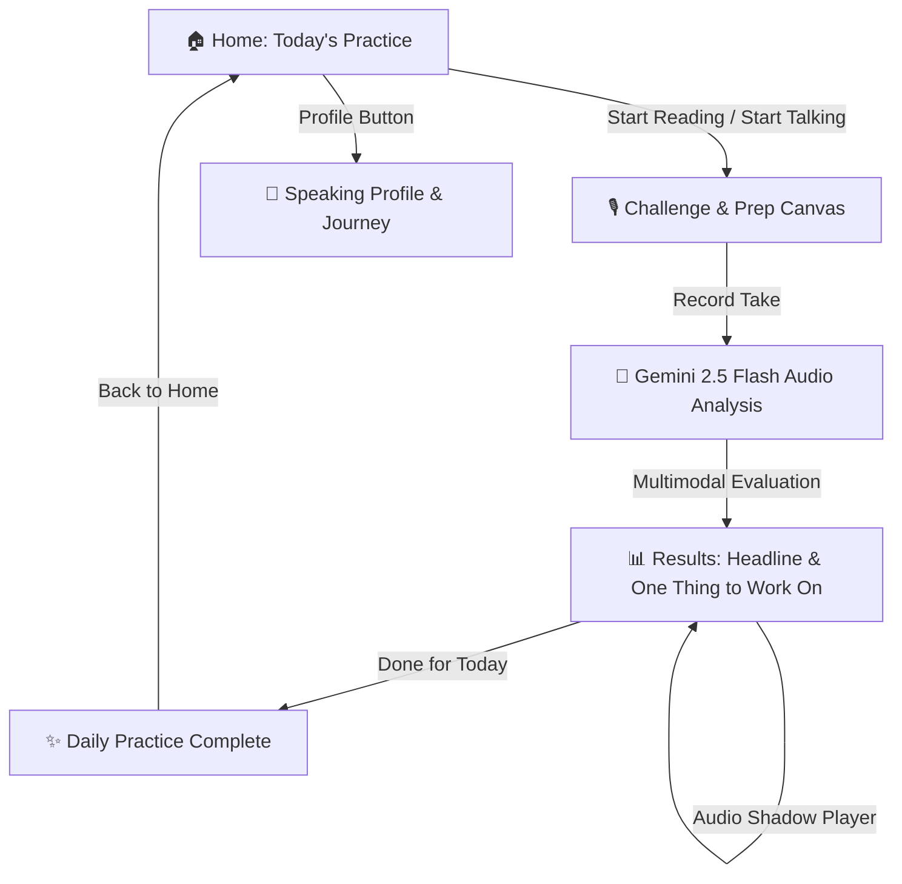

# 🎙️ SayWise - Daily Spoken English Practice

> Build natural spoken English confidence in just **2 focused minutes a day** with personalized AI speech analysis, identity-driven progression, and conversational scenarios.

SayWise is a high-speed, mobile-first speaking app built with **React Native (Expo SDK 54)** and powered by **Google Gemini 2.5 Flash**.

---

## ✨ Features & Architecture

- **🎙️ Dual 2-Minute Daily Practice:**
  - **📖 Read Mode (1 min):** Thought-grouped natural spoken paragraphs to calibrate pronunciation, vowel/consonant clarity, rhythm, and pacing.
  - **🎙️ Talk Mode (1 min):** Engaging situational questions and dilemmas with a 10-second thinking prep timer to build spontaneous fluency, vocabulary retrieval, and conversational confidence.
- **🎯 "Chosen For You" Personalization:**
  - Explains the exact coaching rationale behind today's challenge (e.g., *"Your pacing has been improving, so today's challenge gives you slightly longer sentences to practice natural pauses."*).
- **📊 Real Speaking Profile (No Gamified Clutter):**
  - **Authentic Metrics:** Tracks **Clarity, Fluency, Pacing, and Expression** starting from a clean, neutral baseline.
  - **Tangible Growth:** Real-time trajectory highlights (e.g. `Fluency +8 this week ↗`, `Pacing ↑`).
  - **5-Step Speaking Journey:** A natural milestone roadmap (*Started ➔ Finding your voice ➔ Speaking more naturally ➔ Expressing ideas clearly ➔ Confident speaker*) with an active skill focus (`🎯 You're working toward: Natural pacing 72 → 80`).
- **🏆 Personal Records:**
  - Automatic detection and celebration of personal bests across Fluency, Clarity, Pacing, and Overall score.
- **💡 Actionable Post-Session Coaching:**
  - **Coach Headline:** Immediate assessment (e.g., *"Clear pronunciation, but bring more life to your voice."*).
  - **🎯 One Thing to Work On:** One concrete, actionable takeaway to focus on in tomorrow's session.
  - **Dual-Speed Audio Replay:** Review takes at `1.0x` (Normal) and `0.75x` (Slow-Mo) for syllable calibration.
- **⚡ Token-Optimized Speech Evaluation:**
  - High-speed, focused JSON evaluation payload powered by Google Gemini 2.5 Flash multi-modal audio.
- **🔒 Privacy First:** Ephemeral audio recordings are deleted immediately following evaluation.
- **⚡ Zero-Lag Native Architecture:** Instant screen transitions backed by offline **MMKV** key-value persistence with 100% GPU Native Driver waveform equalizers.

---

## 📱 App Flow



---

## 🛠️ Tech Stack

- **Framework:** [React Native](https://reactnative.dev/) `0.81.5` / [Expo SDK 54](https://expo.dev/)
- **Runtime:** Hermes Engine (New Architecture Ready)
- **Styling:** [NativeWind v4](https://www.nativewind.dev/) (Tailwind CSS `v3.4`)
- **AI Intelligence:** [Google Gemini 2.5 Flash API](https://ai.google.dev/)
- **Audio Engine:** `expo-audio` & `expo-file-system`
- **Storage:** `react-native-mmkv` (Zero-latency offline key-value storage)
- **Icons:** `@expo/vector-icons` (Ionicons)

---

## 🚀 Getting Started

### Prerequisites

- [Node.js](https://nodejs.org/) (v18 or higher)
- [Android Studio](https://developer.android.com/studio) (for Android Emulator / Native Device builds) or physical Android device connected via USB with USB Debugging enabled
- Google Gemini API Key from [Google AI Studio](https://aistudio.google.com/)

### 1. Clone and Install Dependencies

```bash
git clone https://github.com/Snaehath/SayWise.git
cd saywise
npm install
```

### 2. Configure Environment Variables

Create a `.env` file in the root directory:

```bash
cp .env.example .env
```

Add your Gemini API key to `.env`:

```env
EXPO_PUBLIC_GEMINI_API_KEY=your_actual_gemini_api_key_here
```

### 3. Run the App

#### Android (Development Build):
```bash
npx expo run:android
```

#### Metro Bundler:
```bash
npx expo start
```

---

## 📂 Project Structure

```
saywise/
├── assets/                    # App icons and splash screens
├── src/
│   ├── components/            # Reusable UI components
│   │   ├── AudioShadowPlayer.tsx # Take audio player with 1.0x/0.75x speed toggle
│   │   ├── Button.tsx         # Tactile button with zero press delay & hitSlop
│   │   ├── Header.tsx         # Top app navigation bar
│   │   └── RecordingVisualizer.tsx # GPU native-driver audio recording equalizer
│   ├── data/                  # Offline curriculum & generation manifold
│   │   └── challenges.ts      # Read & Talk scenario recipes with 'Chosen for you' rationales
│   ├── navigation/            # Navigation routing
│   │   └── AppNavigator.tsx   # Lightweight screen switcher
│   ├── screens/               # Core application screens
│   │   ├── WelcomeScreen.tsx  # Minimalist home dashboard, 2-minute daily card
│   │   ├── ChallengeScreen.tsx# Speaking screen with 10s prep timer & equalizer
│   │   ├── AnalysisScreen.tsx # AI audio processing with clean status feedback
│   │   ├── ResultScreen.tsx   # Coach headline, biggest improvement & tomorrow's focus
│   │   ├── CompletionScreen.tsx# Session celebration & closure
│   │   └── JourneyScreen.tsx  # Personal speaking story, records & weekly consistency
│   ├── services/              # API & Audio Business Logic
│   │   ├── analysisService.ts # Gemini 2.5 Flash audio evaluation & feedback
│   │   ├── challengeService.ts# Deterministic 1-global-daily challenge engine
│   │   └── recordingService.ts# Expo Audio lifecycle & cache management
│   ├── storage/               # Offline Persistence
│   │   └── challengeStorage.ts# MMKV speaker profile, 5-step journey & personal bests
│   ├── theme/                 # Design tokens & color system
│   └── types/                 # TypeScript interfaces and data models
├── App.tsx                    # Application entry root with SafeAreaProvider
├── app.json                   # Expo configuration & app metadata
├── metro.config.js            # Metro bundler config with NativeWind
├── tailwind.config.js         # Tailwind styling theme & color tokens
└── package.json               # Project dependencies & scripts
```

---

## 🔒 Security

- Sensitive credentials (Gemini API keys) are strictly managed via environment variables (`.env`) and excluded from source control via `.gitignore`.
- Temporary recording audio clips are deleted immediately after AI evaluation.

---

## 📝 License

This project is licensed under the MIT License.
