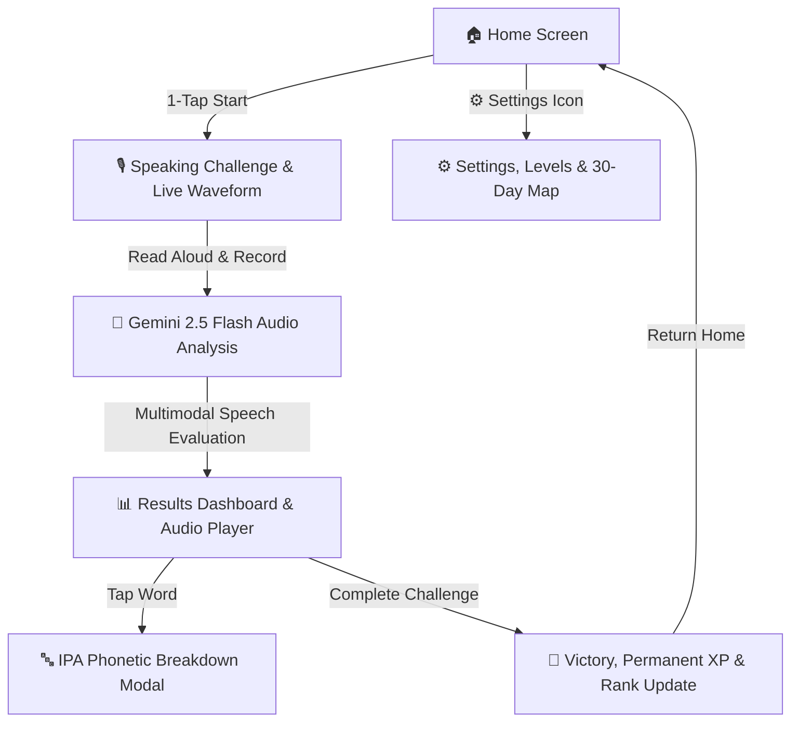

# 🎙️ SayWise - Daily Spoken English Practice

> Build natural spoken English confidence in just **2 focused minutes a day** with instant AI-powered speech analysis and permanent mastery progression.

SayWise is a high-speed, mobile-first daily speaking app built with **React Native (Expo SDK 54)** and powered by **Google Gemini 2.5 Flash**.

---

## ✨ Features & Architecture

- **🚀 1-Tap Zero-Friction Launch:** Tapping *"Start Today's Challenge"* immediately opens today's reading challenge with zero decision fatigue.
- **⏳ Authentic Daily Quest Ritual & Countdown:**
  - One focused calibration quest per day to build sustainable habit formation without burnout.
  - Completed state features a **live ticking countdown timer** (`⏳ Next Daily Challenge in 14h 22m 18s`) and instant access to review your take's analysis and audio.
- **🏆 Permanent Mastery & XP Progression Engine (Zero Anxiety):**
  - **No Punitive Streaks:** Say goodbye to broken-streak anxiety. Progress and levels **NEVER reset to zero** — every single 2-minute session permanently builds your speaking ability.
  - **🚀 First-Time Kickstart Boost (Level 1 ➔ 2):** Completing your 1st challenge awards `+200 XP` (`100 Base + 100 Kickstart Boost`) for an **instant level up to Level 2**!
  - **🎯 Precision Articulation Rewards:** Scoring 85%+ crisp pronunciation awards `+25 Bonus XP`.
  - **🥋 Progressive Speaker Ranks (Levels 1–10):**
    - *Voice Novice 🌱 ➔ Cadence Apprentice 🎯 ➔ Rhythm Adept 🌿 ➔ Speech Practitioner 💫 ➔ Fluent Speaker ⚡ ➔ Voice Grandmaster 👑*
  - **⚡ Tier Unlock Milestones:**
    - **Level 1–4:** Beginner Mode 🌱
    - **Level 5 Unlock:** Intermediate Mode ⚡ (`1100 XP` permanent milestone)
    - **Level 10 Unlock:** Advanced Mastery Mode 👑 (`3600 XP` permanent milestone)
- **🧠 NanoQwen On-Device Curriculum Engine:**
  - 30+ curated daily practice scenarios across all difficulty tiers.
  - Contextual openers and diverse topics (everyday routines, mindfulness, teamwork, AI ethics, persuasive rhetoric).
  - Dynamic phoneme articulatory targets (e.g. *Vowel elongation, Consonant clusters, Phrasing pauses*).
- **⚙️ Settings & Level Management Screen:**
  - Top header **Gear Button** (`settings-outline`) on the Home screen.
  - Difficulty tier selector with clean lock badges (`🔒 Unlocks at Level 5`).
  - **📅 30-Day Vocal Activity Matrix:** Clean GitHub-style contribution matrix neatly organized in Settings.
  - Lifetime speaking metrics (total words spoken, practice minutes, total days completed).
- **🔤 Interactive Word-Level IPA Breakdown:**
  - **Color-Coded Word Chips:** Every word in your reading is color-coded by articulation accuracy:
    - 🟢 **Crisp Articulation (85+ Score)**
    - 🟡 **Review / Minor Slip**
    - 🔴 **Needs Work / Distortion**
  - **Tap-to-Inspect Phonetic Modal:** Tap any word to view its **International Phonetic Alphabet (IPA)** transcription (e.g. `[ /ˈkɑːɡ.nə.tɪv/ ]`) and targeted mouth/tongue positioning tips.
- **🎧 Audio Replay & Shadowing Player:**
  - Replay your recorded take directly on the Results screen.
  - **`1.0x` (Normal)** and **`0.75x` (Slow-Mo)** playback speed toggle for deep syllable calibration.
- **🌊 Dynamic Live Waveform Equalizer:**
  - 11-bar smooth audio equalizer pulsing rhythmically during speech recording.
- **🤖 Gemini 2.5 Flash Evaluation Engine:**
  - **Overall Score (0–100)** with visual metric progress bars.
  - **Pronunciation, Accuracy, Fluency, and Pacing** breakdowns.
  - **Words Per Minute (WPM)** speed calculation.
  - **Actionable Coaching Takeaways:** 1 top strength + 1 key focus area.
- **🔒 Privacy First:** Ephemeral audio recordings are deleted immediately following evaluation.
- **⚡ Zero-Lag Architecture:** Instant 0ms screen navigation with offline **MMKV** key-value persistence.

---

## 📱 App Flow



---

## 🛠️ Tech Stack

- **Framework:** [React Native](https://reactnative.dev/) `0.81.5` / [Expo SDK 54](https://expo.dev/)
- **Runtime:** Hermes Engine (New Architecture Ready)
- **Styling:** [NativeWind v4](https://www.nativewind.dev/) (Tailwind CSS `v3.4`)
- **AI Intelligence:** [Google Gemini 2.5 Flash API](https://ai.google.dev/)
- **Audio Engine:** `expo-audio` & `expo-file-system`
- **Storage:** `react-native-mmkv` (Zero-latency offline key-value storage)
- **Icons:** `@expo/vector-icons` (Ionicons)

---

## 🚀 Getting Started

### Prerequisites

- [Node.js](https://nodejs.org/) (v18 or higher)
- [Android Studio](https://developer.android.com/studio) (for Android Emulator / Native Device builds) or physical Android device connected via USB with USB Debugging enabled
- Google Gemini API Key from [Google AI Studio](https://aistudio.google.com/)

### 1. Clone and Install Dependencies

```bash
git clone https://github.com/Snaehath/SayWise.git
cd saywise
npm install
```

### 2. Configure Environment Variables

Create a `.env` file in the root directory:

```bash
cp .env.example .env
```

Add your Gemini API key to `.env`:

```env
EXPO_PUBLIC_GEMINI_API_KEY=your_actual_gemini_api_key_here
```

### 3. Run the App

#### Android (Development Build):
```bash
npx expo run:android
```

#### Metro Bundler:
```bash
npx expo start
```

---

## 📂 Project Structure

```
saywise/
├── assets/                    # App icons and splash screens
├── src/
│   ├── components/            # Reusable UI components
│   │   ├── ActivityHeatmap.tsx # 30-day activity matrix (GitHub contribution style)
│   │   ├── AudioShadowPlayer.tsx # Take audio player with 1.0x/0.75x speed toggle
│   │   ├── Button.tsx         # Tactile button with animated scale feedback
│   │   ├── DifficultyCard.tsx # Radio tier selection card
│   │   ├── Header.tsx         # Top app navigation bar
│   │   ├── LevelCard.tsx      # Permanent Level & XP progress card
│   │   ├── MetricStatsRow.tsx # Growth metrics row (words, minutes, total days)
│   │   ├── ProgressBar.tsx    # Animated metric progress bar
│   │   ├── RecordingVisualizer.tsx # Live 11-bar audio recording equalizer
│   │   ├── ScoreCard.tsx      # Dashboard ring score & 4-metric progress bars
│   │   └── WordPhoneticModal.tsx # Tap-to-inspect IPA & articulation modal
│   ├── data/                  # Offline curriculum & generation manifold
│   │   └── challenges.ts      # NanoQwen synthesis engine & 30+ daily topics
│   ├── navigation/            # Navigation routing
│   │   └── AppNavigator.tsx   # Lightweight, instant screen state switcher
│   ├── screens/               # Core application screens
│   │   ├── WelcomeScreen.tsx  # Home dashboard, level progress & 1-tap start
│   │   ├── SettingsScreen.tsx # Level progression, locked tiers & 30-day map
│   │   ├── ChallengeScreen.tsx# Read-aloud paragraph & live waveform recording
│   │   ├── AnalysisScreen.tsx # AI audio processing & pulsing visualizer
│   │   ├── ResultScreen.tsx   # Word-level chips, audio playback & score card
│   │   ├── DifficultyScreen.tsx # Standalone tier switcher
│   │   └── CompletionScreen.tsx# Victory celebration, XP awards & summary
│   ├── services/              # API & Audio Business Logic
│   │   ├── analysisService.ts # Gemini 2.5 Flash audio transcription, scoring & IPA
│   │   ├── challengeService.ts# Daily speaking challenge retrieval
│   │   └── recordingService.ts# Expo Audio lifecycle & cache management
│   ├── storage/               # Offline Persistence
│   │   └── challengeStorage.ts# MMKV level engine, permanent XP & 30-day activity
│   ├── theme/                 # Design tokens & color system
│   └── types/                 # TypeScript interfaces and data models
├── App.tsx                    # Application entry root with SafeAreaProvider
├── app.json                   # Expo configuration & app metadata
├── metro.config.js            # Metro bundler config with NativeWind
├── tailwind.config.js         # Tailwind styling theme & color tokens
└── package.json               # Project dependencies & scripts
```

---

## 🔒 Security

- Sensitive credentials (Gemini API keys) are strictly managed via environment variables (`.env`) and excluded from source control via `.gitignore`.
- Temporary recording audio clips are deleted immediately after AI evaluation.

---

## 📝 License

This project is licensed under the MIT License - feel free to customize and use it for your own speaking practice!
