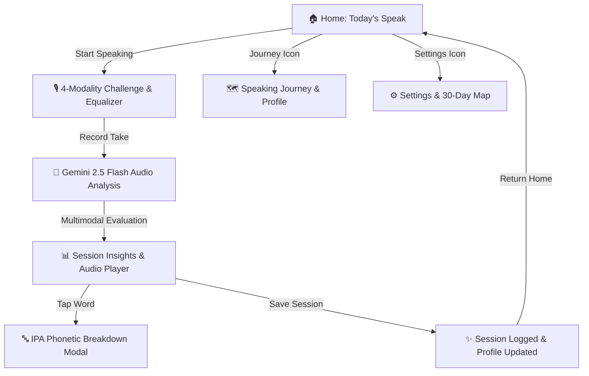

# 🎙️ SayWise - Daily Spoken English Practice

> Build natural spoken English confidence in just **2 focused minutes a day** with personalized AI speech analysis, identity-driven progression, and conversational scenarios.

SayWise is a high-speed, mobile-first speaking app built with **React Native (Expo SDK 54)** and powered by **Google Gemini 2.5 Flash**.

---

## ✨ Features & Architecture

- **🎙️ Clean 2-Minute Daily Habit Ritual:**
  - Fast, zero-friction home dashboard focused entirely on **becoming a better speaker**.
  - Daily challenge with a dedicated focus target (e.g. *"Speak naturally + slow down slightly"*).
  - Live countdown timer for the next daily calibration and instant access to review previous takes.
- **🌱 Speaker Identity & Personal Journey (No Gamey XP Anxiety):**
  - **Speaker Profile:** Evaluates multidimensional skills across **Clarity, Fluency, Pacing, and Expression** with growth trajectories (e.g. `Fluency ↑ 12%`, `↑ 4% better this week`).
  - **Identity Milestones:** Progress through speaking stages (*Voice Novice 🌱 ➔ Clear Speaker 🎯 ➔ Natural Speaker 🌿 ➔ Confident Speaker 💫 ➔ Expressive Speaker ⚡ ➔ Powerful Speaker 👑*).
  - **Speaking Journey Timeline:** Visual story of your milestones (*Started ➔ 3 Sessions ➔ First Full Speech ➔ Improved Pacing ➔ 100 Words ➔ First 80+ Score ➔ Current Focus*).
  - **Invisible Gamification:** Progression mechanics work under the hood without cluttering the UI with childish level numbers.
- **🏆 Personal Bests Recognition:**
  - Automatic detection and celebration of personal records (e.g. *"🏆 New Personal Best: Fluency 86"*).
- **🎭 4 Dynamic Speaking Modalities:**
  1. 📖 **Read:** Natural thought-grouped passages for pronunciation, rhythm, and cadence.
  2. 💭 **Explain:** Spontaneous explanation prompts for fluency and narrative flow.
  3. 🎯 **Describe:** Situational sensory descriptions for vocabulary retrieval and vocal variety.
  4. ⚡ **Quick Opinion:** Provocative workplace and daily scenarios with a 10s prep timer for spontaneous speaking.
- **🤖 Personalized AI Challenge Recipe Engine:**
  - Gemini 2.5 Flash dynamically crafts tomorrow's challenge tailored to the learner's state (strengths, weaknesses, recent topics, pacing targets).
  - High-quality offline fallback presets covering 30+ real-world conversational dilemmas.
- **💡 Actionable Post-Session Coaching:**
  - **Coach Headline:** Immediate assessment (e.g. *"You sounded more natural today"*).
  - **One Thing to Improve:** Concrete, actionable guidance for tomorrow's practice.
  - **Word-Level Articulation & IPA Inspection:** Tap any word to inspect phonetic IPA transcriptions and tongue/mouth positioning tips.
  - **Dual-Speed Audio Replay:** Review takes at `1.0x` (Normal) and `0.75x` (Slow-Mo) for syllable calibration.
- **🔒 Privacy First:** Ephemeral audio recordings are deleted immediately following evaluation.
- **⚡ Zero-Lag Architecture:** Instant screen transitions backed by offline **MMKV** key-value persistence.

---

## 📱 App Flow



---

## 🛠️ Tech Stack

- **Framework:** [React Native](https://reactnative.dev/) `0.81.5` / [Expo SDK 54](https://expo.dev/)
- **Runtime:** Hermes Engine (New Architecture Ready)
- **Styling:** [NativeWind v4](https://www.nativewind.dev/) (Tailwind CSS `v3.4`)
- **AI Intelligence:** [Google Gemini 2.5 Flash API](https://ai.google.dev/)
- **Audio Engine:** `expo-audio` & `expo-file-system`
- **Storage:** `react-native-mmkv` (Zero-latency offline key-value storage)
- **Icons:** `@expo/vector-icons` (Ionicons)

---

## 🚀 Getting Started

### Prerequisites

- [Node.js](https://nodejs.org/) (v18 or higher)
- [Android Studio](https://developer.android.com/studio) (for Android Emulator / Native Device builds) or physical Android device connected via USB with USB Debugging enabled
- Google Gemini API Key from [Google AI Studio](https://aistudio.google.com/)

### 1. Clone and Install Dependencies

```bash
git clone https://github.com/Snaehath/SayWise.git
cd saywise
npm install
```

### 2. Configure Environment Variables

Create a `.env` file in the root directory:

```bash
cp .env.example .env
```

Add your Gemini API key to `.env`:

```env
EXPO_PUBLIC_GEMINI_API_KEY=your_actual_gemini_api_key_here
```

### 3. Run the App

#### Android (Development Build):
```bash
npx expo run:android
```

#### Metro Bundler:
```bash
npx expo start
```

---

## 📂 Project Structure

```
saywise/
├── assets/                    # App icons and splash screens
├── src/
│   ├── components/            # Reusable UI components
│   │   ├── ActivityHeatmap.tsx # 30-day activity matrix (GitHub contribution style)
│   │   ├── AudioShadowPlayer.tsx # Take audio player with 1.0x/0.75x speed toggle
│   │   ├── Button.tsx         # Tactile button with animated scale feedback
│   │   ├── DifficultyCard.tsx # Radio tier selection card
│   │   ├── Header.tsx         # Top app navigation bar
│   │   ├── JourneyTimeline.tsx # Vertical speaking story milestones timeline
│   │   ├── LevelCard.tsx      # Permanent progression & XP card
│   │   ├── MetricStatsRow.tsx # Growth metrics row (words, minutes, total days)
│   │   ├── ProgressBar.tsx    # Animated metric progress bar
│   │   ├── RecordingVisualizer.tsx # Live 11-bar audio recording equalizer
│   │   ├── ScoreCard.tsx      # Dashboard ring score & 4-metric progress bars
│   │   ├── SpeakerProfileCard.tsx # Multidimensional skills & identity card
│   │   └── WordPhoneticModal.tsx # Tap-to-inspect IPA & articulation modal
│   ├── data/                  # Offline curriculum & generation manifold
│   │   └── challenges.ts      # 4 Modality speech synthesis engine & scenario recipes
│   ├── navigation/            # Navigation routing
│   │   └── AppNavigator.tsx   # Lightweight screen switcher
│   ├── screens/               # Core application screens
│   │   ├── WelcomeScreen.tsx  # Minimalist home dashboard, 2-minute daily card
│   │   ├── JourneyScreen.tsx  # Personal speaking story, records & skill radar
│   │   ├── SettingsScreen.tsx # Tier switcher & 30-day consistency map
│   │   ├── ChallengeScreen.tsx# Speaking screen with 10s prep timer & equalizer
│   │   ├── AnalysisScreen.tsx # AI audio processing & pulsing visualizer
│   │   ├── ResultScreen.tsx   # Coach headline, trajectories, tomorrow's focus & replay
│   │   ├── DifficultyScreen.tsx # Standalone tier switcher
│   │   └── CompletionScreen.tsx# Session celebration & identity summary
│   ├── services/              # API & Audio Business Logic
│   │   ├── analysisService.ts # Gemini 2.5 Flash audio evaluation & feedback
│   │   ├── challengeService.ts# Personalized AI recipe synthesis & daily rotation
│   │   └── recordingService.ts# Expo Audio lifecycle & cache management
│   ├── storage/               # Offline Persistence
│   │   └── challengeStorage.ts# MMKV speaker profile, journey milestones & personal bests
│   ├── theme/                 # Design tokens & color system
│   └── types/                 # TypeScript interfaces and data models
├── App.tsx                    # Application entry root with SafeAreaProvider
├── app.json                   # Expo configuration & app metadata
├── metro.config.js            # Metro bundler config with NativeWind
├── tailwind.config.js         # Tailwind styling theme & color tokens
└── package.json               # Project dependencies & scripts
```

---

## 🔒 Security

- Sensitive credentials (Gemini API keys) are strictly managed via environment variables (`.env`) and excluded from source control via `.gitignore`.
- Temporary recording audio clips are deleted immediately after AI evaluation.

---

## 📝 License

This project is licensed under the MIT License - feel free to customize and use it for your own speaking practice!
